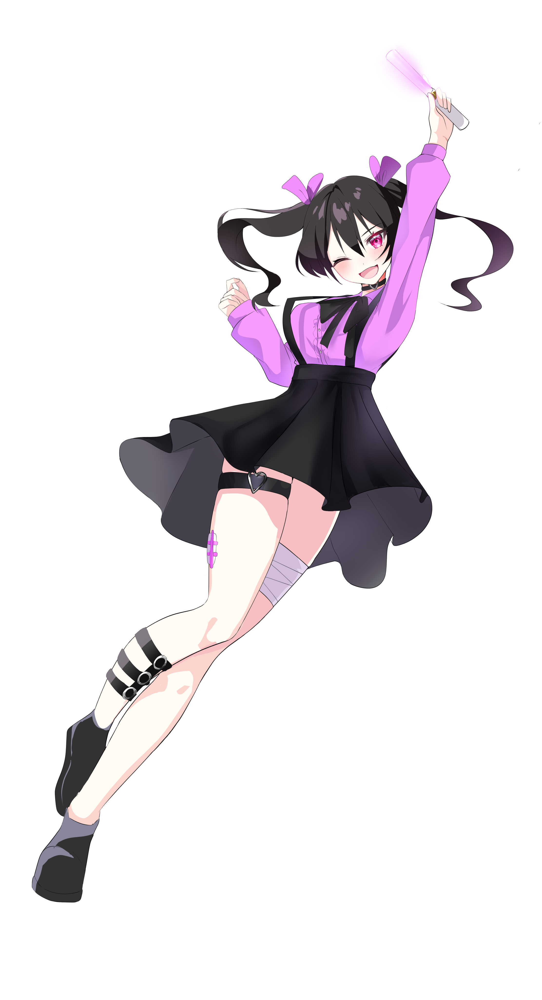

# 操作説明
mocopiを頭、左手首、右手首、腰、左足首、右足首に装着する。  
Mocopiの専用アプリでmocopiを接続する。この時スマートフォンとパソコンを同じWi-Fiに接続しておく。  
Joy-Conは右手でも左手でもどっちに持ってもよい。

### プレイヤーの移動
- 歩き：mocopiを装着して足踏みをする
- かき分け：mocopiを装着して腕を肩ぐらいに上げて横に動かす
- しゃがみ：mocopiを装着して腰を地面の近くまで落とす
- 方向転換：Joy-conのスティックを左右に倒すことで体の方向を回転させる

### Joy-Conの操作
- Joy-ConのＡボタン：決定ボタン、（ゲームクリア時）歓声を鳴らす
- Joy-ConのＢボタン：（ゲームクリア時）歓声を鳴らす
- Joy-ConのＹボタン：（スタートボタン選択時）チュートリアルなしを選択する
- Joy-ConのＲボタン：（チェキ風クリア画面時）Ｒボタンを押してＡボタンを押すことでスキップする
- Joy-ConのSRぼたん：（メインゲーム中）ゲームを中断しタイトルに遷移する
- Joy-ConのSLボタン：マウスカーソルの表示・非表示
- Joy-Conのスティックボタン：（メインゲーム中）俯瞰視点にカメラが切り替わる

***

### 主人公の情報
  
名前：じらじょちゃん  
由来：地雷系の服を着た少女  
特徴：  
・ 地下アイドルユニットの「Dreams」を激推ししている少女。  
・ 推しに認知をもらう為にライブに通うも最前列を取れたことが無く、毎回後ろの方になってしまう。  
・ その状況を脱出するために彼女はある行動を決行することを決める。  
・ それが観客をかき分けて最前列に行くことである。

***

### 敵の情報
名前：警備員  
特徴：  
・ ライブの安全を守るために活動している。  
・ 観客の周りを巡回する警備員と観客の中に入って見守っている警備員がいる。
・ 巡回している警備員に見つかって捕まったり、見守っている警備員に当たった場合、ゲームオーバーになる。
・ 警備員の顔は怖い顔をしている。

*** 

### 観客の情報
- 一般的な観客  
特徴：  
・ 髪の毛が白く、水色と白色の服を着ている。  
・ 背丈は「じらじょちゃん」とほぼおなじである。  
・ 「じらじょちゃん」に及ぼす影響はほぼない。
- 背の大きな観客  
特徴：  
・ 髪の毛が黒く、水色と白色の服を着ている。  
・ 背丈は「じらじょちゃん」より大きい。  
・ 背が大きいため、ステージ上にいるアイドル達が見ずらい。 
- ぽっちゃりな観客  
特徴：  
・ 髪の毛が黒く、ピンク色のワンピースを着ている。  
・ 背丈は「じらじょちゃん」とほぼ同じで、横幅と奥行きがでかい。  
・ 体重が重いが故に、かき分けてもあまり移動しない。  
・ それどころかき分けて移動させたと思ったら戻ってくる力が強く当たると「じらじょちゃん」が押し戻される。

